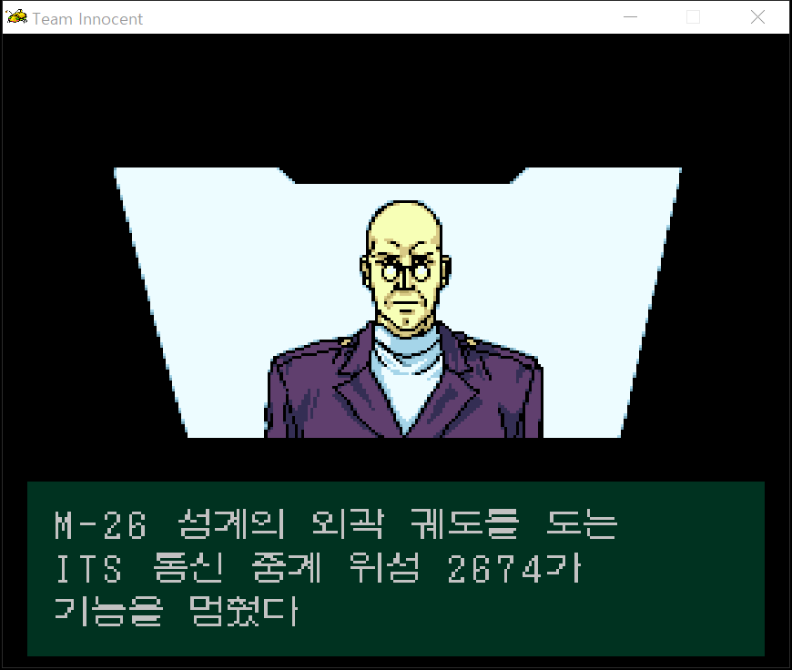

  

# PC-FX 팀 이노센트 한국어 패치

> [!WARNING]
> **v0.7은 플레이 검증이 끝나지 않은 테스트 버전입니다.** 게임 전체를 끝까지 진행하며 모든 문구와 영상을 확인하지 않았습니다. 누락된 자막, 잘못된 번역, 타이밍 및 표시 오류가 있을 수 있습니다. 원본 디스크와 저장 파일을 보관하고 테스트해 주세요.

일본판 **Team Innocent: The Point of No Return - G.C.P.O.SS**의 텍스트와 영상 음성을 한국어로 즐기기 위한 패치입니다. 이 저장소와 배포 ZIP에는 게임의 CUE/BIN 파일이 들어 있지 않습니다.

## v0.7에 들어 있는 내용

- 영어 패치의 텍스트 변경 범위를 참고해 일본판 대사 1,371개와 메뉴·상태·아이템·엔딩 문구 등에 한글 초안을 적용했습니다. 원래 영어인 UI 문구는 그대로 둡니다.
- 한글 시작 화면을 적용하고 **PUSH RUN BUTTON**이 원판처럼 깜빡이도록 했습니다.
- 이름이 확인된 영상 7개에 자막 147개를 넣었습니다. 그중 일본어 음성 번역 초안이 133개입니다. 자막은 영상에 인코딩하지 않고 게임의 별도 화면 레이어로 표시합니다. 일반 대사창에는 영상 자막을 띄우지 않습니다.
- 랑그릿사 FX 한국어 작업에서 사용한 글꼴과 12픽셀 자막 표시 규칙을 따릅니다. 실제 띄어쓰기에는 반각 공백을 사용했습니다.

**검증 범위:** 디스크에 저장된 글씨와 자막 데이터의 재읽기 검사는 통과했습니다. 오프닝 외 6개 영상은 격리 재생에서 한글 자막 표본을 확인했습니다. **실제 플레이 중 이 6개 영상의 호출, 전체 일본어 원음, 번역과 자막 타이밍은 아직 검증하지 않았습니다.** 따라서 v0.7을 완성판으로 취급하지 말아 주세요.

## 화면

| 게임에서 실행한 한글 시작 화면 | 영상 위 별도 레이어 자막 |
| --- | --- |
|  |  |

### 게임 대사 화면

미션 1 브리핑에서 실제로 표시된 한글 대사창입니다.

| 긴급 지령 | 통신 위성 보고 | 조사 보고 |
| --- | --- | --- |
|  |  |  |

맨 위의 큰 이미지는 시작 화면의 원화입니다. 표 안의 이미지는 에뮬레이터에서 캡처한 화면입니다. **PUSH RUN BUTTON**은 게임 안에서 깜빡이므로 정지 스크린샷에서는 보이지 않을 수 있습니다.

## 적용 방법

1. [v0.7 배포 ZIP](https://github.com/OldManCraveGuitars-bit/PC-FX-Team-Innocent-Kr/releases/tag/v0.7)을 내려받아 압축을 풉니다.
2. 자신의 **일본판 14트랙** CUE/BIN 파일을 모두 **original_disc** 폴더에 넣습니다. 폴더가 없으면 새로 만듭니다. 파일 이름은 원본 Redump 명칭이어야 합니다.
3. Windows에서 Python 3이 설치된 상태로 **apply_patch.cmd**를 실행합니다. 또는 아래 명령을 실행합니다.

       python apply_patch.py --source "원본 디스크 폴더"

4. 만들어진 **patched_disc/Team Innocent - The Point of No Return - G.C.P.O.SS (Japan).cue**를 PC-FX 에뮬레이터에서 엽니다.

패치 프로그램은 원본 Track 02의 SHA-256이 **56931167724db296481606b6ba4d873097754faf4a59bd352a030dd8301028aa**인지 검사합니다. 패치 후에도 결과 해시를 검사합니다. **원본 디스크 파일을 덮어쓰지 않습니다.** 다른 덤프에는 적용하지 않습니다.

배포본에는 표준 **xdelta** 파일도 들어 있습니다. 다른 패처를 쓰고 싶다면 원본 **Track 02 BIN**을 소스로 지정해 **patches/Team-Innocent-KR-v0.7.xdelta**를 적용한 뒤, 나머지 13개 트랙과 원본 CUE를 함께 사용하세요. 동봉한 **apply_patch.cmd**는 별도 xdelta 실행 파일 없이 **tipatch** 파일을 사용합니다.

## 문제 제보

[Issues](https://github.com/OldManCraveGuitars-bit/PC-FX-Team-Innocent-Kr/issues)에 게임 구간, 원문 또는 잘못된 문구, 가능하면 스크린샷과 함께 남겨 주세요. 자막 문제라면 영상 이름과 대략적인 시각도 적어 주시면 수정에 도움이 됩니다. **이 버전은 테스트용이므로 플레이 중 확인되는 오류를 받아 고쳐 나갈 예정입니다.**

## 감사와 출처

[Team Innocent 영어 패치 팀](https://github.com/DerekPascarella/TeamInnocent-EnglishPatchPCFX)의 작업은 이 한국어 패치에 **큰 도움**이 됐습니다. 영어 패치가 정리한 텍스트 변경 지점과 자료 덕분에 일본판의 문구를 찾고 대조할 수 있었습니다. **Derek Pascarella (ateam), Elmer, EsperKnight, Filler, Eien ni Hen, Josh (hasnopants)를 비롯한 영어 패치 참여자 모두에게 진심으로 감사드립니다.** 이 한국어 패치는 영어 패치 팀의 공식 배포물이 아닙니다.

게임과 원본 그래픽의 권리는 각 권리자에게 있습니다. 패치에는 원본 게임 이미지 전체를 포함하지 않습니다. 글꼴은 Unifont 17.0.05와 Neo둥근모 1.601을 참고했으며 라이선스 고지문은 [licenses](licenses)에 있습니다.
