

  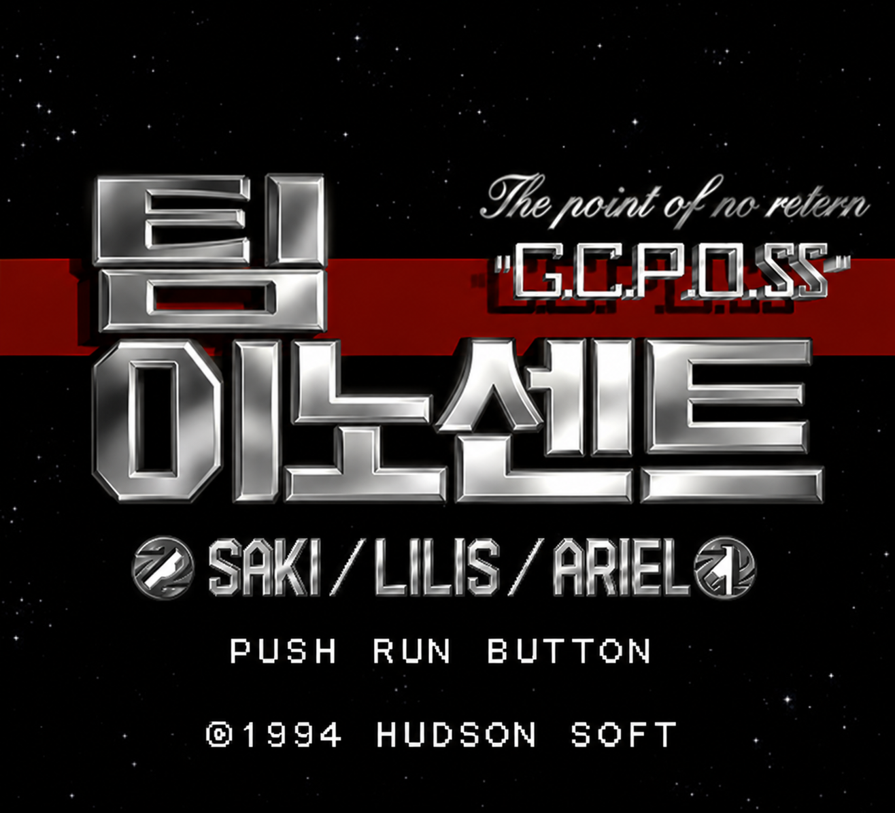

# PC-FX 팀 이노센트 한국어 패치

> [!WARNING]
> **v0.735는 플레이 검증이 끝나지 않은 테스트 버전입니다.** 게임 전체를 끝까지 진행하며 모든 문구와 영상을 확인하지 않았습니다. 누락된 자막, 잘못된 번역, 타이밍 및 표시 오류가 있을 수 있습니다. 원본 디스크와 저장 파일을 보관하고 테스트해 주세요.

일본판 **Team Innocent: The Point of No Return - G.C.P.O.SS**의 텍스트와 영상 음성을 한국어로 즐기기 위한 패치입니다. 이 저장소와 배포 ZIP에는 게임의 CUE/BIN 파일이 들어 있지 않습니다.

## v0.735에 들어 있는 내용

- 영어 패치의 텍스트 변경 범위를 참고해 일본판 대사 1,371개와 메뉴·상태·아이템·엔딩 문구 등에 한글 초안을 적용했습니다. 원래 영어인 UI 문구는 그대로 둡니다.
- 한글 시작 화면을 적용하고 **PUSH RUN BUTTON**이 원판처럼 깜빡이도록 했습니다.
- 이름이 확인된 영상 장면 8개에 자막 168개를 넣었습니다. 첫 오프닝의 후반 문장·음성 대사와 두 번째 오프닝 노래 자막도 포함하며, 음성 번역과 노래 가사는 1차 초안입니다. 자막은 영상에 인코딩하지 않고 게임의 별도 화면 레이어로 표시합니다. 일반 대사창에는 영상 자막을 띄우지 않습니다.
- 랑그릿사 FX 한국어 작업에서 사용한 글꼴과 12픽셀 자막 표시 규칙을 따릅니다. 실제 띄어쓰기에는 반각 공백을 사용했습니다.
- 대사 표시 중 **Ⅱ를 누르면** 현재 문장이 원래 줄바꿈대로 끝까지 표시됩니다. 이어서 **Ⅰ을 누르면 현재 음성과 모션을 끊고**, 다음 대사와 그 장면의 모션이 처음부터 시작됩니다. v0.73에서 음성이 끝나기를 기다리던 문제를 수정했습니다.
- 영상 자막이 문장 전환 순간 화면 위로 튀던 현상을 수정했습니다. `제~대로`는 `제대로`로 고쳤습니다.

**검증 범위:** 대사 1,371개와 영상 8개 장면의 자막 168개를 디스크에서 다시 읽어 검사했습니다. v0.735 배포 디스크의 코드로 미션 1 브리핑에서 Ⅱ → Ⅰ 전환과 연속 넘기기를 시험했고, 음성·모션 종료를 기다리던 구간이 다음 대사로 전환되는 것을 확인했습니다. 자막이 위로 튀던 현상은 같은 영상 구간의 수정 전후 프레임과 좌표 기록을 대조했습니다. 이전 테스트에서는 브리핑 이후 여성 캐릭터의 한글 대사창도 확인했습니다. **빠른 넘기기의 모든 장면, 전체 플레이, 모든 일본어 원음과 자막 타이밍 검증은 아직 끝나지 않았습니다.** 두 번째 오프닝 노래 자막도 원음 재검수가 필요한 초안입니다.

## 화면

| 게임에서 실행한 한글 시작 화면 | 영상 위 별도 레이어 자막 |
| --- | --- |
| 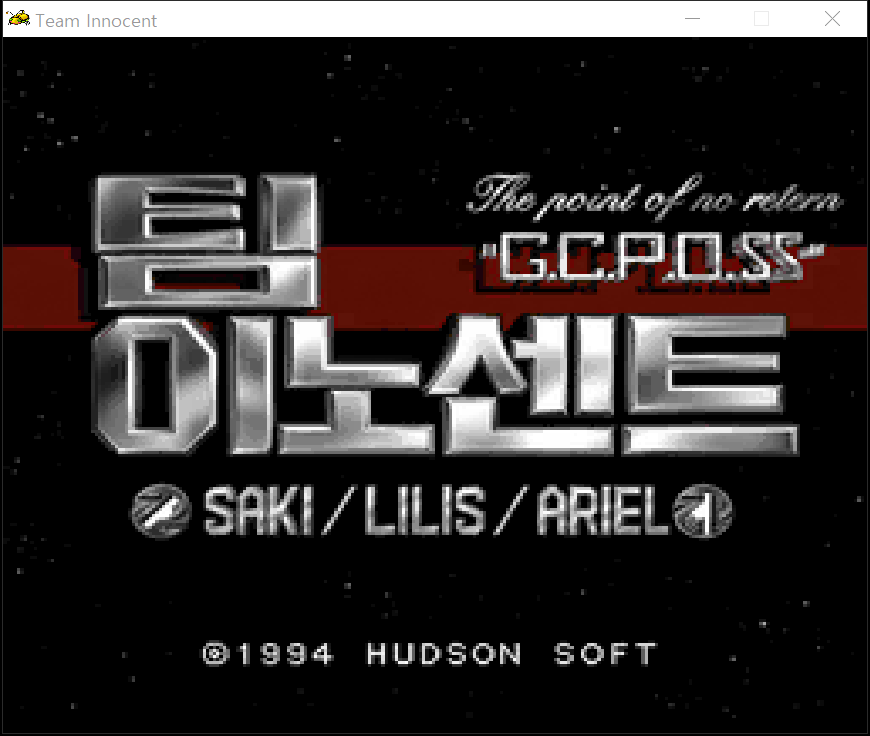 | 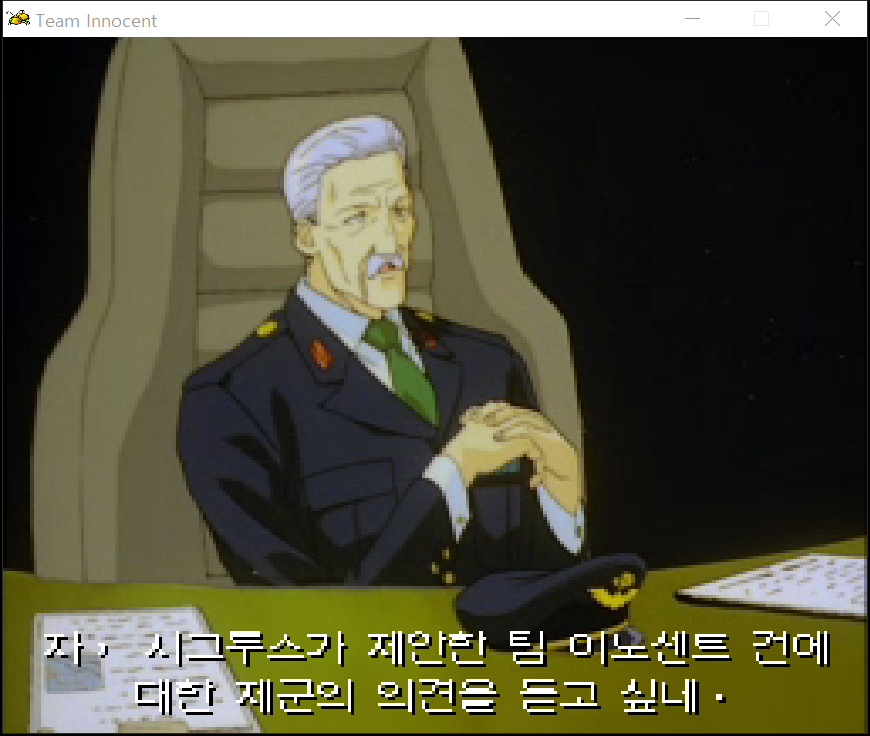 |

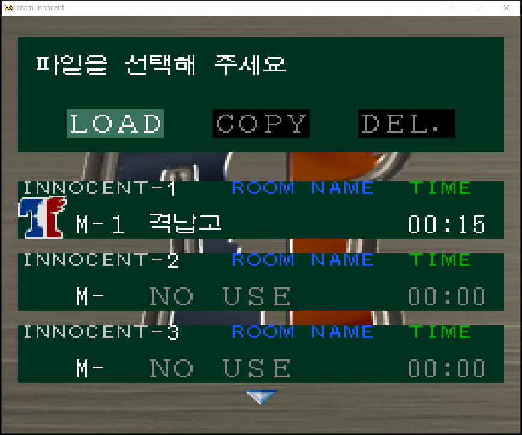

### 게임 대사 화면

이전 테스트판을 처음부터 실행해 브리핑과 영상을 지난 뒤, 게임 대사창에 한글이 표시되는 것을 확인했습니다. 아래 두 장은 미션 1 격납고에서 여성 캐릭터들이 대화하는 실제 플레이 화면입니다.

| 여성 캐릭터 대화 1 | 여성 캐릭터 대화 2 |
| --- | --- |
| 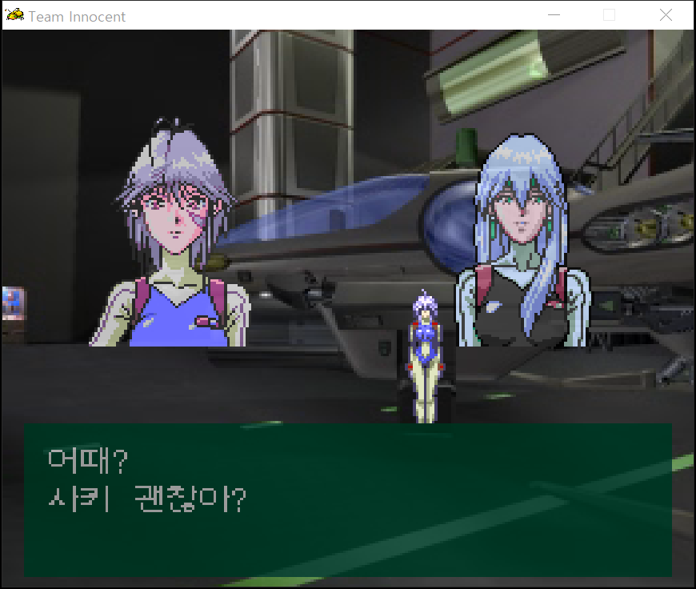 | 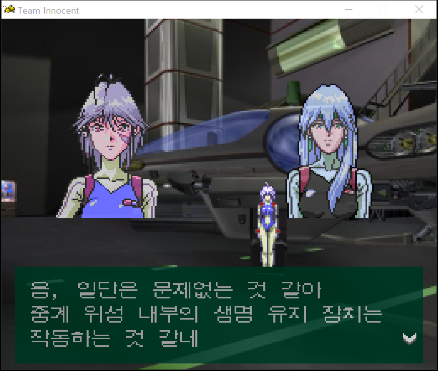 |

브리핑 화면의 잘못된 배경 크기와 위치를 v0.72에서 바로잡았습니다. 아래는 수정한 디스크를 처음부터 실행한 화면입니다.

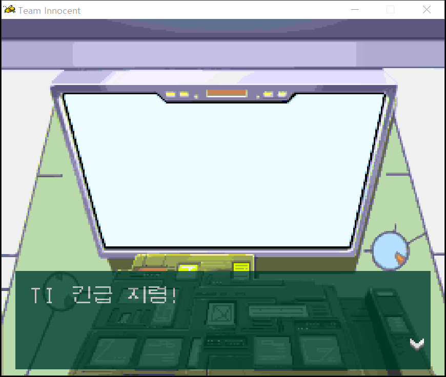

브리핑 대사도 한글로 표시됩니다.

| 긴급 지령 | 조사 보고 |
| --- | --- |
| 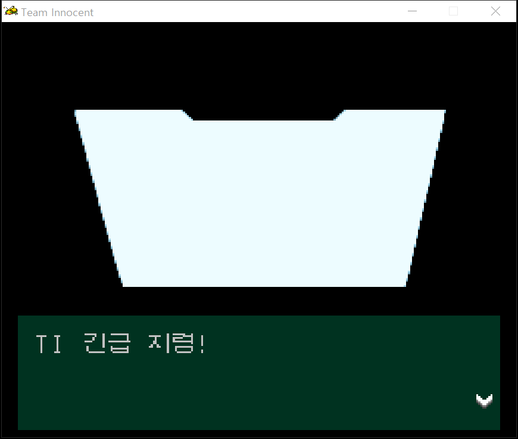 | 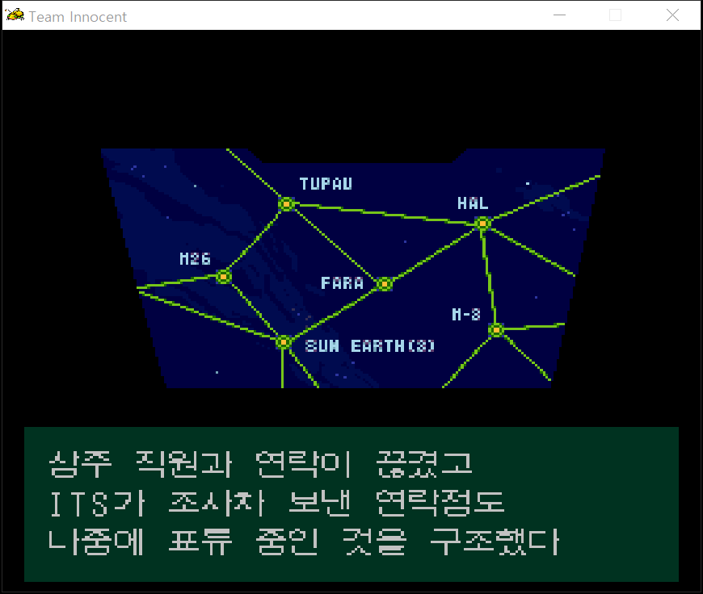 |

### v0.735 빠른 대사 넘기기 수정

1. 글자가 나오는 도중 **Ⅱ**: 현재 대사를 끝까지 표시합니다. 음성은 이어집니다.
2. 대사가 완성된 뒤 **Ⅰ**: 현재 **음성과 캐릭터 모션을 중단**합니다.
3. 다음 대사와 음성이 나오고, 캐릭터는 다음 대사의 모션 시작으로 이동합니다.

v0.73에서는 글자만 빨리 표시되고 음성·모션 대기가 남아 있었습니다. v0.735에서 이 대기를 수정했습니다. 다음 화면은 최종 배포 디스크의 코드를 적용한 미션 1 브리핑 시험에서 캡처했습니다.

| Ⅱ로 글자를 완성한 상태 | 음성 도중 Ⅰ을 눌러 다음 대사로 전환 |
| --- | --- |
| 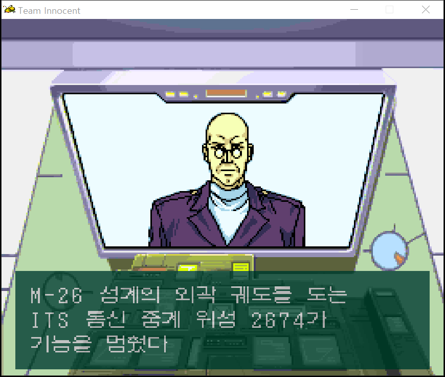 | 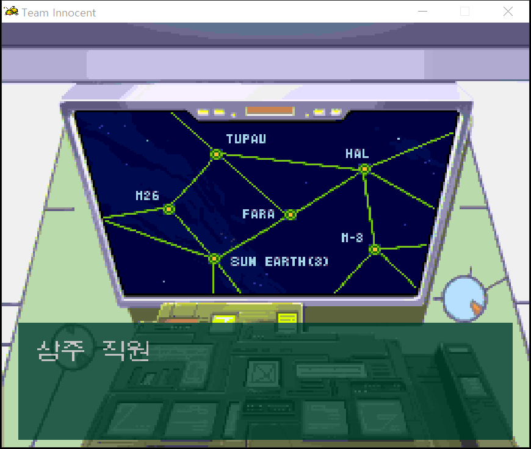 |

### 여성 캐릭터가 나오는 영상 대사

아래 두 장은 게임 대사창이 아니라 영상에 별도 레이어로 표시한 한국어 음성 자막입니다.

| 회의 장면 | 팀 장면 |
| --- | --- |
|  | 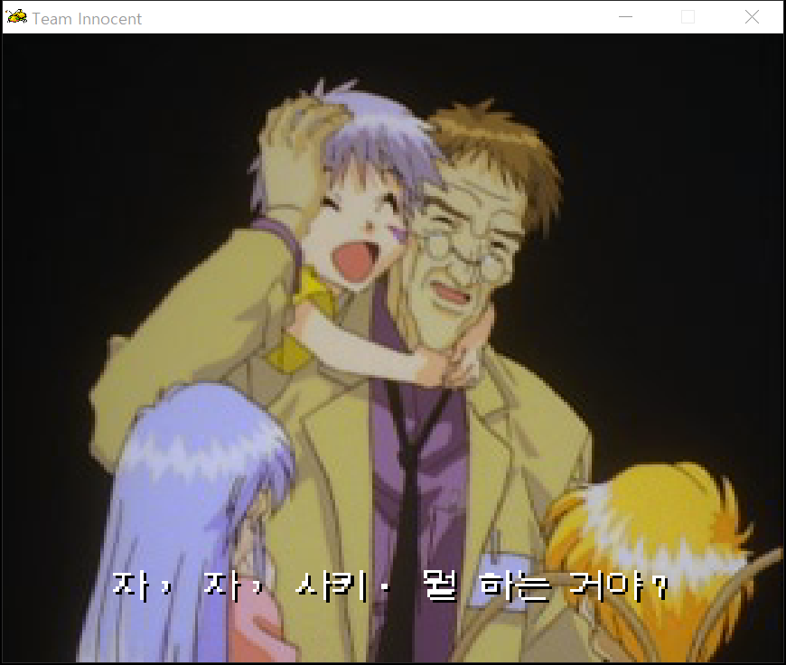 |

맨 위의 큰 이미지는 시작 화면의 원화입니다. 표 안의 이미지는 에뮬레이터에서 캡처한 화면입니다. **PUSH RUN BUTTON**은 게임 안에서 깜빡이므로 정지 스크린샷에서는 보이지 않을 수 있습니다.

## 적용 방법 (Windows)

1. [v0.735 배포 ZIP](https://github.com/OldManCraveGuitars-bit/PC-FX-Team-Innocent-Kr/releases/tag/v0.735)을 풀거나, 같은 페이지에서 **Team-Innocent-KR-Patcher.exe**를 받습니다.
2. **Team-Innocent-KR-Patcher.exe**를 실행하고 보유한 일본판 **Team Innocent CUE 파일**을 선택합니다. 원본 BIN 14개는 CUE와 같은 폴더에 있어야 합니다.
3. 결과를 저장할 새 폴더를 확인한 다음 **한국어 패치 적용**을 누릅니다. 검사가 끝나면 **완성 폴더 열기**로 결과를 확인할 수 있습니다.
4. 새 폴더의 **Team Innocent - The Point of No Return - G.C.P.O.SS (Japan).cue**를 PC-FX 에뮬레이터에서 엽니다.

**업데이트 후에는 새 디스크를 처음부터 부팅해 주세요.** 이전 버전에서 만든 에뮬레이터 강제 저장 상태에는 이전 패치 코드가 남아 있을 수 있습니다. 게임 안에서 만든 저장 파일은 새로 부팅한 뒤 불러오세요.

GUI EXE에는 패치 데이터가 들어 있으며 **Python 설치가 필요 없습니다**. 기본 창 크기에서도 **한국어 패치 적용** 버튼과 진행 기록이 보이도록 배치를 고쳤습니다. 작업 중 취소할 수 있고, 실패하거나 취소하면 임시 결과를 정리합니다. 원본은 읽기만 합니다.

Python을 쓰는 경우 ZIP에 있는 **apply_patch.cmd**를 실행하거나 아래 명령을 사용할 수도 있습니다.

    python apply_patch.py --source "원본 디스크 폴더" --output "새 출력 폴더"

패치 프로그램은 원본 Track 02의 SHA-256이 **56931167724db296481606b6ba4d873097754faf4a59bd352a030dd8301028aa**인지 검사합니다. 패치 후에도 결과 해시를 검사합니다. **원본 디스크 파일을 덮어쓰지 않습니다.** 다른 덤프에는 적용하지 않습니다.

배포본에는 표준 **xdelta** 파일도 들어 있습니다. 다른 패처를 쓰고 싶다면 원본 **Track 02 BIN**을 소스로 지정해 **patches/Team-Innocent-KR-v0.735.xdelta**를 적용한 뒤, 나머지 13개 트랙과 원본 CUE를 함께 사용하세요. 동봉한 **apply_patch.cmd**는 별도 xdelta 실행 파일 없이 **tipatch** 파일을 사용합니다.

## 문제 제보

[Issues](https://github.com/OldManCraveGuitars-bit/PC-FX-Team-Innocent-Kr/issues)에 게임 구간, 원문 또는 잘못된 문구, 가능하면 스크린샷과 함께 남겨 주세요. 자막 문제라면 영상 이름과 대략적인 시각도 적어 주시면 수정에 도움이 됩니다. **이 버전은 테스트용이므로 플레이 중 확인되는 오류를 받아 고쳐 나갈 예정입니다.**

## 감사와 출처

[Team Innocent 영어 패치 팀](https://github.com/DerekPascarella/TeamInnocent-EnglishPatchPCFX)의 작업은 이 한국어 패치에 **큰 도움**이 됐습니다. 영어 패치가 정리한 텍스트 변경 지점과 자료 덕분에 일본판의 문구를 찾고 대조할 수 있었습니다. **Derek Pascarella (ateam), Elmer, EsperKnight, Filler, Eien ni Hen, Josh (hasnopants)를 비롯한 영어 패치 참여자 모두에게 진심으로 감사드립니다.** 이 한국어 패치는 영어 패치 팀의 공식 배포물이 아닙니다.

게임과 원본 그래픽의 권리는 각 권리자에게 있습니다. 패치에는 원본 게임 이미지 전체를 포함하지 않습니다. 글꼴은 Unifont 17.0.05와 Neo둥근모 1.601을 참고했으며 라이선스 고지문은 [licenses](licenses)에 있습니다.
