# PC-FX 팀 이노센트 — 비공식 한글화 1.2 정식 버전

<p align="center"></p>

**Team Innocent: The Point of No Return — G.C.P.O.SS 일본판용 비공식 한국어 패치입니다.** v0.7부터 이어 온 한글화, 대사 검수, 조작 개선과 그래픽·진행 오류 수정을 모아 **v1.2 정식 버전**으로 배포합니다.

### 다운로드

**[Windows 패처 EXE 받기](https://github.com/OldManCraveGuitars-bit/PC-FX-Team-Innocent-Kr/releases/download/v1.2/Team-Innocent-KR-Patcher.exe)** · **[전체 패치 ZIP 받기](https://github.com/OldManCraveGuitars-bit/PC-FX-Team-Innocent-Kr/releases/download/v1.2/Team-Innocent-KR-v1.2.zip)** · **[v1.2 릴리스](https://github.com/OldManCraveGuitars-bit/PC-FX-Team-Innocent-Kr/releases/tag/v1.2)**

[이번 버전 변경 사항](RELEASE_NOTES_v1.2.md) · [누적 변경 이력](CHANGELOG.md) · [실제 스크린샷 46장](SCREENSHOTS.md)

| v1.2에 담긴 내용 | 결과 |
| --- | --- |
| 게임 대사·시스템 문구 | 대사 **1,371개**, 메뉴·아이템·상태·클리어 나레이션·스태프롤 한글화 |
| 대사 검수 | 초기 문구 207개를 포함한 문장 점검, 267개 항목의 띄어쓰기·표현·길이 정리 및 후속 제보 수정 |
| 영상 자막 | **8개 장면, 175개 자막**. 박사·유전자실 누락 대사 보완 |
| 엔딩 | **46개 가사 자막**, 크레딧보다 앞에 표시. 한글화 담당 크레딧 추가 |
| 영상 감상 | 클리어 세이브로 해금되는 **영상 16개 + 엔딩 1개** |
| 조작 선택 | 화면 기준 8방향 이동의 **조작1** / 원작 방식의 **조작2** |
| RUN 지도 | 플레이를 멈추지 않는 반투명 지도, RUN으로 켜기·끄기 |
| 빠른 진행 | Ⅱ로 대사 완성, Ⅰ로 음성·모션 중단 후 다음 대사. 영상은 Ⅰ을 약 1.2초 눌러 건너뛰기 |
| 검수 진행 | **미션 2까지 검수 완료** — 사용자 플레이와 제보 반영 기준. 미션 3·엔딩의 제보된 장면도 추가 수정 |

> [!IMPORTANT]
> **원작과 동일한 조작 방식으로 플레이하고 싶다면 반드시 ‘조작2’를 선택하세요.** 기본값은 새 조작법인 조작1입니다. **SELECT → SYSTEM → MAP → 생명반응 아래 ‘조작1’ → Ⅰ**을 누르면 조작2로 전환됩니다.

## 적용 방법

1. 보유한 **일본판 원본 CUE와 BIN 14개**를 같은 폴더에 준비합니다.
2. 위의 **Team-Innocent-KR-Patcher.exe**를 실행하고 원본 CUE를 선택합니다. **Python 설치는 필요 없습니다.**
3. 결과를 저장할 새 폴더를 정하고 **한국어 패치 적용**을 누릅니다. 기본 크기의 창에서도 적용 버튼이 보입니다.
4. 완료되면 **완성 폴더 열기**를 눌러 생성된 CUE를 PC-FX 에뮬레이터에서 실행합니다.

패처는 원본을 읽어 새 폴더에 결과를 만들고, 적용 전후 해시를 검사합니다. **이전 패치본에 덧씌우지 말고 일본판 원본에 새로 적용해 주세요.**

**업데이트 후에는 에뮬레이터를 종료하고 새 디스크를 처음부터 부팅한 다음 게임 내 LOAD로 저장 데이터를 불러오세요.** 이전 버전의 즉시 저장/상태 저장에는 이전 실행 코드가 남아 있을 수 있습니다. 휴대폰으로 옮길 때도 완성된 CUE와 BIN 14개를 함께 복사합니다.

<details>
<summary>Python·xdelta 적용과 지원 원본 해시</summary>

ZIP의 `apply_patch.cmd`를 실행하거나 다음 명령을 사용합니다.

```text
python apply_patch.py --source "원본 디스크 폴더" --output "새 출력 폴더"
```

다른 패처에서는 **원본 Track 02 BIN**에 `Team-Innocent-KR-v1.2.xdelta`를 적용하고, 나머지 13개 트랙과 원본 CUE를 함께 사용합니다. Python 패처는 별도 xdelta 프로그램 없이 동봉한 `.tipatch`를 사용합니다.

| 검사 대상 | SHA-256 |
| --- | --- |
| 일본판 원본 Track 02 | `56931167724db296481606b6ba4d873097754faf4a59bd352a030dd8301028aa` |
| v1.2 적용 후 Track 02 | `3dd9748242e39c05671a220b89b61743ae5fd7634a79848c196124238132763d` |

배포 파일의 해시는 릴리스에 첨부한 `SHA256SUMS-v1.2.txt`에서 확인할 수 있습니다.

</details>

## RUN 지도 — 게임 화면 위에서 켜고 끄기

**필드에서 RUN을 한 번 누르면 화면 중앙에 지도가 켜지고, 다시 누르면 꺼집니다.** 지도를 켜도 게임은 계속 진행되며, 이동·조사·전투를 할 수 있습니다.

1. 캐릭터를 조작할 수 있는 필드에서 **PC-FX 패드의 RUN**을 한 번 누릅니다. 에뮬레이터에서는 RUN에 배정한 키나 화면 버튼을 사용합니다.
2. **녹색 지도와 흰색 현재 위치 표시**가 나타납니다. 지도창의 배경과 테두리를 없애 게임 화면을 함께 볼 수 있습니다.
3. 다른 방이나 층으로 이동하면 해당 공간의 지도와 위치 표시가 자동으로 바뀝니다.
4. RUN을 놓았다가 다시 한 번 누르면 OFF입니다. 계속 누르는 동안 반복 전환되지는 않습니다.

| 항목 | 동작 |
| --- | --- |
| 처음 부팅할 때 | **OFF**. 켜기·끄기 선택은 저장 파일에 영구 저장하지 않습니다. |
| 지원 모드 | **조작1·조작2 모두 사용 가능** |
| 표시 농도 | **불투명도 37.5% / 투명도 62.5%**로 배경이 보이도록 표시 |
| 현재 위치 | 원작 MAP의 **현재 방·구역 단위 위치**를 따라 갱신. 방 안의 이동 궤적을 정밀하게 추적하는 방식은 아닙니다. |
| 방·층 이동 | 새로운 공간의 지도를 자동으로 불러옵니다. |
| 대화·영상·메뉴·페이드 | 연출 중에는 숨기고, ON 상태라면 필드 조작으로 돌아오면 다시 표시합니다. |
| 원래 MAP 메뉴 | 기존처럼 사용할 수 있습니다. RUN 지도와 별개로 조작 모드 변경도 이 메뉴에서 합니다. |

RUN 지도는 필드에서 사용합니다. **타이틀 화면의 RUN은 메인 메뉴를 여는 버튼**이며, **영상 건너뛰기는 Ⅰ을 약 1.2초 누르는 조작**입니다.

| RUN 지도 OFF | RUN 지도 ON — 배경을 보면서 플레이 |
| --- | --- |
| 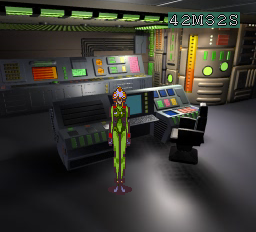 | 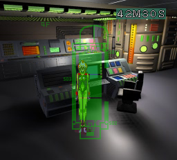 |

## 조작 모드 바꾸기

**원작 방식은 조작2입니다.** 조작1에서는 SELECT, 조작2에서는 Ⅲ으로 메뉴를 연 뒤 **SYSTEM → MAP**으로 들어갑니다. **생명반응 아래, EXIT 위**에 있는 조작 항목에 커서를 놓고 **Ⅰ**을 누르면 두 모드가 전환됩니다. 선택은 게임 저장 파일에 영구 저장하지 않으며 새로 부팅하면 조작1로 시작합니다.

| 조작1 — 신규 조작 | 조작2 — 원작 조작 |
| --- | --- |
|  | 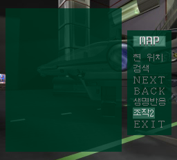 |

## 조작 방법 비교표

버튼은 **PC-FX 패드 기준**입니다. 에뮬레이터에서 해당 버튼에 배정한 키 또는 패드 버튼을 사용하세요. **Ⅰ=1, Ⅱ=2, Ⅲ=3, Ⅳ=4, Ⅴ=5, Ⅵ=6**입니다. 조작1의 전용 공격을 사용하려면 Ⅳ·Ⅴ·Ⅵ도 입력 설정에 배정해야 합니다.

| 기능 / 상황 | 조작1 — 신규 조작 | 조작2 — 원작 조작 |
| --- | --- | --- |
| **이동** | 십자키를 누른 **화면 방향으로 즉시 이동**합니다. 상하좌우와 대각선, 총 8방향입니다. | **위: 전진 / 아래: 후진 / 좌우: 방향 회전**으로 이동합니다. |
| **카메라가 바뀔 때** | 같은 방향을 계속 누르면 처음 정해진 이동 방향을 유지합니다. 방향을 놓거나 변경하면 현재 화면을 기준으로 다시 정합니다. | 원작의 방향 처리와 이동 유지 동작을 그대로 사용합니다. |
| **메뉴 열기** | **SELECT** | **Ⅲ (3번)** |
| **플레이 중 지도 ON/OFF** | **RUN** | **RUN** |
| **조사·결정 등** | **Ⅰ (1번)** — 기존 기능 | **Ⅰ (1번)** — 기존 기능 |
| **Ⅱ (2번)** | 게임에서 **점프가 허용된 상태면 점프 우선**. 그 밖에는 기존 Ⅱ 동작을 합니다. | ACTION에서 선택한 동작을 실행합니다. |
| **펀치** | **Ⅳ (4번)** | ACTION에서 **PUNCH** 선택 후 **Ⅱ** |
| **킥** | **Ⅴ (5번)** | ACTION에서 **KICK** 선택 후 **Ⅱ** |
| **사격** | **Ⅵ (6번)** — 장착한 사격 무기로 발사합니다. 총을 내린 상태에서는 준비 동작 후 한 발을 발사합니다. | ACTION에서 **SHOOT** 선택 후 **Ⅱ**로 원래 사격 조작을 합니다. |
| **점프** | 점프 가능한 상태에서 **Ⅱ** | ACTION에서 **JUMP** 선택 후 **Ⅱ**, 원래 점프 조건 적용 |
| **달리기** | **Ⅲ을 누른 채 십자키로 이동**. Ⅲ을 놓으면 걷기로 돌아옵니다. | 원래 조작대로 **위 방향을 빠르게 두 번** 입력합니다. |
| **백스텝** | **Ⅲ을 빠르게 두 번** 누릅니다. 두 번째 입력은 달리기보다 백스텝을 우선합니다. | 원래 조작대로 **아래 방향을 빠르게 두 번** 입력합니다. |
| **메뉴 안에서 선택·취소** | 기존 메뉴 조작 사용 | 기존 메뉴 조작 사용 |
| **대사 글자 즉시 완성** | 글자가 나오는 중 **Ⅱ** | 글자가 나오는 중 **Ⅱ** |
| **다음 대사로 이동** | 글자가 모두 나온 뒤 **Ⅰ** — 현재 음성과 모션 중단 | 글자가 모두 나온 뒤 **Ⅰ** — 현재 음성과 모션 중단 |
| **영상 건너뛰기** | 영상 재생 중 **Ⅰ을 약 1.2초간 계속 누르기** | 영상 재생 중 **Ⅰ을 약 1.2초간 계속 누르기** |

### 조작1 사용 시 알아둘 점

- **이동 방향 유지 예시:** 오른쪽을 누르고 이동하다 시점이 바뀌어도, 같은 입력을 유지하는 동안에는 기존 진행 방향으로 계속 갑니다. 새 화면의 오른쪽으로 이동하려면 방향을 놓았다가 다시 누르세요. 원작에도 있던 이동 유지 동작을 고려해 신규 조작에 적용했습니다.
- **달리기와 백스텝:** 달리기는 Ⅲ을 계속 누릅니다. 백스텝은 **누름 → 놓음 → 빠르게 다시 누름**입니다. 한 번 길게 누르는 입력은 두 번 누르기로 취급하지 않습니다.
- **사격 조건:** 사격 가능한 무기를 장착해야 하며, 무기 보유·탄약 등 원래 조건을 따릅니다. 근접 무기를 장착한 상태에서 Ⅵ을 눌러 총을 쏘는 기능은 아닙니다.
- **점프 조건:** 원래 게임에서 점프가 허용되는 경우에만 Ⅱ의 점프 우선 동작이 적용됩니다. 점프할 수 없는 곳에서는 기존 Ⅱ 기능으로 동작합니다.
- **동작 제한:** 공격·피격·점프 등의 처리와 충돌 판정은 원래 게임의 제한을 따릅니다. 공격 회복 중 모든 동작을 즉시 취소할 수 있는 것은 아닙니다.
- 메뉴·대화·영상에서의 기존 Ⅰ·Ⅱ 조작과 이전 패치의 대사/영상 건너뛰기 기능은 두 모드 모두 사용할 수 있습니다.

| 필드 이동 재현 화면 | 전용 사격 동작 재현 화면 |
| --- | --- |
| 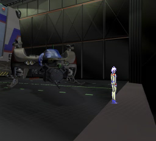 | 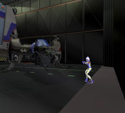 |

## 대사 빠른 넘기기와 영상 건너뛰기

| 상황 | 조작 | 결과 |
| --- | --- | --- |
| 대사 글자가 나오는 중 | **Ⅱ (2번)** | 현재 대사를 끝까지 표시합니다. 음성은 계속 나옵니다. |
| 대사가 모두 표시된 상태 | **Ⅰ (1번)** | 현재 음성과 캐릭터 모션을 중단하고 다음 대사로 이동합니다. 다음 음성과 모션은 시작부터 재생합니다. |
| 연속해서 넘기기 | **Ⅱ → Ⅰ 반복** | 같은 방식으로 다음 대사를 빠르게 넘깁니다. |
| 오프닝·인게임 영상 | **Ⅰ을 약 1.2초 동안 계속 누르기** | 영상·음성·자막을 종료하고 다음 장면으로 이동합니다. 감상 메뉴에서는 목록으로 돌아옵니다. |

영상 건너뛰기는 중간에 손을 떼면 시간이 초기화됩니다. 짧게 여러 번 누르는 입력은 누적하지 않습니다. 일반 대화와 17번 엔딩은 영상 건너뛰기 대상이 아닙니다.

일반 대화의 화자 전환과 MO 녹화 대사에도 빠른 넘기기를 적용했습니다. MO 대사에서 Ⅰ·Ⅱ를 연타하면 멈추던 문제와, MO 01의 PLAY 상태에서 첫 자료를 넘길 수 없던 문제를 수정했습니다.

| Ⅱ로 대사 글자 완성 | 음성 종료를 기다리지 않고 다음 화자로 이동 |
| --- | --- |
| 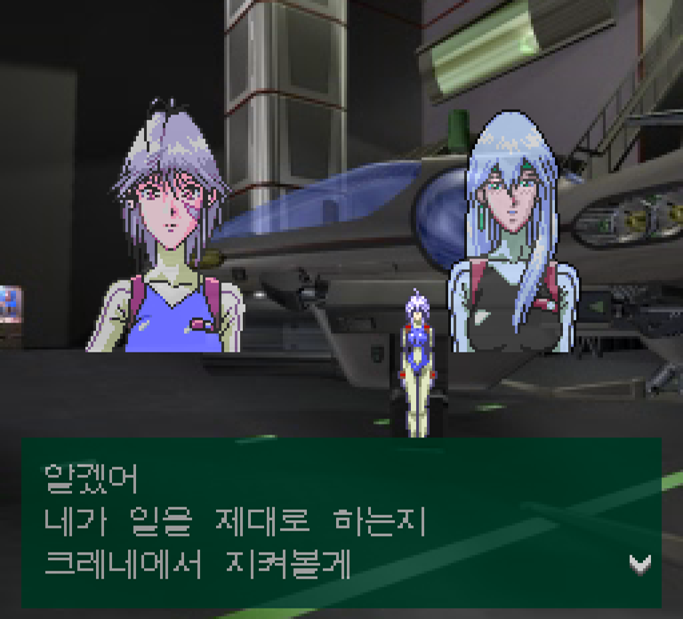 | 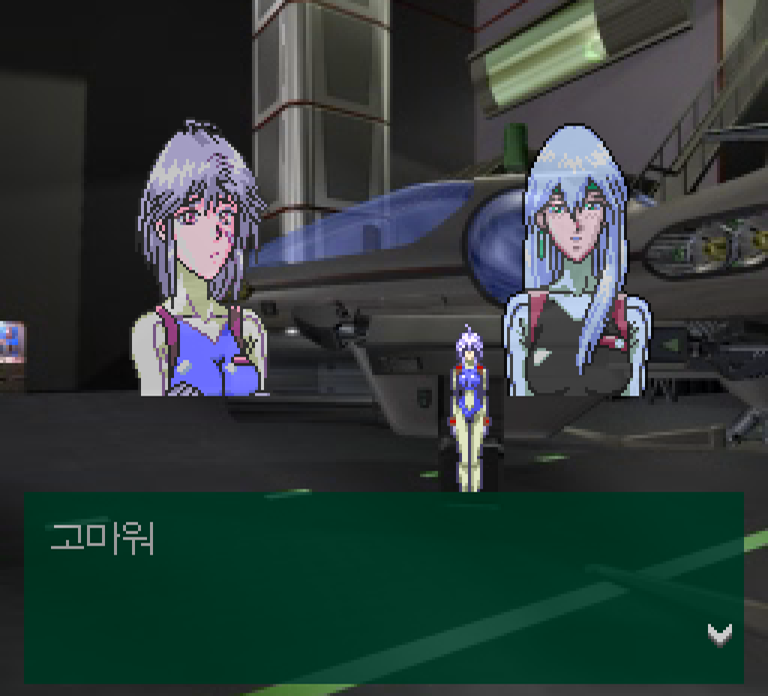 |

| MO 녹화의 한글 대사 | 반복 입력 뒤 MO 재생 종료 확인 |
| --- | --- |
| 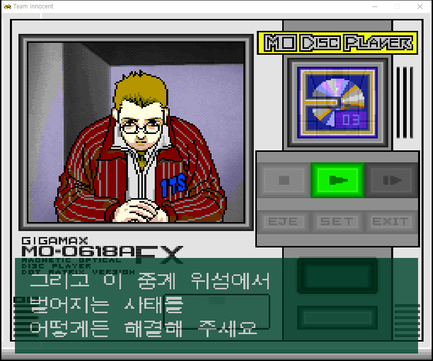 | 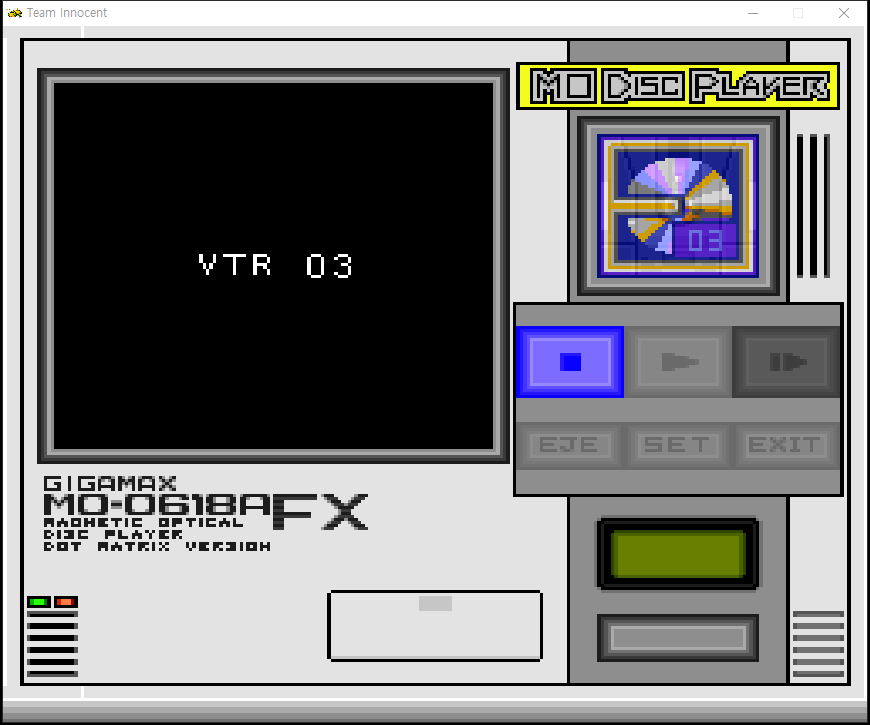 |

## v1.2 영상 감상과 엔딩 다시 보기

타이틀에서 **RUN → 영상 감상**으로 들어갑니다. 본편의 클리어 이벤트 목록과 별도로, 영상을 직접 선택해 볼 수 있는 메뉴입니다.

### 클리어 데이터가 있어야 열립니다

| 저장 데이터 | 영상 감상 항목 |
| --- | --- |
| 유효한 클리어 세이브가 있음 | 활성화. **Ⅰ**로 목록에 들어갑니다. |
| 클리어 세이브가 없음 | **회색으로 표시하며 Ⅰ을 눌러도 열리지 않습니다.** |

저장 슬롯 중 하나에 본편의 클리어 상태가 기록되어 있으면 열립니다. 단순히 미션 3에 진입한 데이터만으로는 해금되지 않습니다. 영상 감상은 게임 진행 데이터나 저장 내용을 바꾸지 않습니다.

| 클리어 데이터가 있는 메인 메뉴 | 클리어 데이터가 없어 잠긴 영상 감상 |
| --- | --- |
| 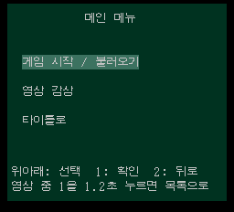 | 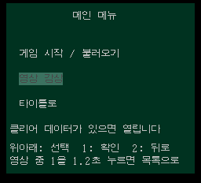 |

### 감상 조작

| 상황 | 조작 / 동작 |
| --- | --- |
| 목록 선택 | 십자키 위·아래 |
| 선택한 항목 재생 | **Ⅰ (1번)** |
| 뒤로 | 목록에서 **Ⅱ (2번)** |
| 01~16 영상 중단 | **Ⅰ을 약 1.2초 동안 계속 누르면 목록으로 복귀** |
| 영상 자연 종료 | 목록으로 자동 복귀, 선택했던 항목 유지 |
| 17 엔딩 | 노래·그림·크레딧을 끝까지 재생한 뒤 목록으로 자동 복귀. **영상용 Ⅰ 길게 누르기 건너뛰기는 적용하지 않습니다.** |

### 수록 목록

| 번호 | 항목 | 번호 | 항목 |
| --- | --- | --- | --- |
| 01 | 오프닝 이야기 | 10 | 크로노스와 소녀들 |
| 02 | 오프닝 노래 | 11 | GCPO 회의 |
| 03 | 사키의 출동 | 12 | 미션 3 영상 1 |
| 04 | 격납고 출격 | 13 | 미션 3 영상 2 |
| 05 | 아리엘의 출동 | 14 | **오프닝 영상 (추가 수록본)** |
| 06 | 사키의 샤워 | 15 | 지하 통로 1 |
| 07 | 크로노스의 설명 | 16 | 지하 통로 2 |
| 08 | 유전자실 | 17 | **엔딩 (노래와 크레딧)** |
| 09 | 크로노스의 재판 | | |

14번에서 오프닝 노래가 나오는 것은 해당 원본 영상의 내용입니다. 기존 임시 이름인 **‘미션 3 영상 3’**이 내용을 잘못 안내하고 있어 **‘오프닝 영상 (추가 수록본)’**으로 바꿨습니다.

| 내용에 맞게 고친 14번 영상 이름 | 별도 항목으로 수록한 17번 엔딩 |
| --- | --- |
| 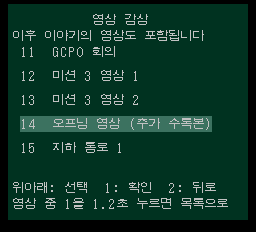 | 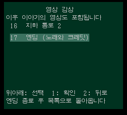 |

### 엔딩 가사와 크레딧

- 원래 엔딩의 노래, 배경 그림과 스태프롤을 함께 재생합니다.
- 한국어 가사 **46개 자막**은 스크롤과 별도로, **크레딧보다 앞쪽 레이어**에 표시합니다.
- 영어 번역팀 크레딧 다음에 **‘한글화 기타 깎는 노인’** 한 줄을 추가했습니다.
- 자막이 바뀔 때 크레딧과 화면이 순간적으로 떨리던 표시 처리를 수정했습니다.
- 엔딩을 본 뒤 다른 영상을 재생할 때 자막 영역이 깨지던 문제를 수정했습니다.
- 본편에서 엔딩을 마치면 원래의 **CLEAR EVENT LIST**로, 영상 감상에서 엔딩을 마치면 감상 목록으로 돌아갑니다.

| 크레딧보다 앞에 표시되는 엔딩 가사 | 영어 번역팀 뒤에 추가한 한글화 크레딧 |
| --- | --- |
| 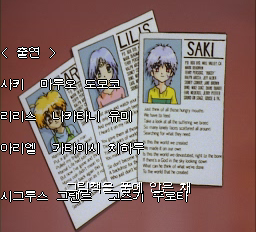 | 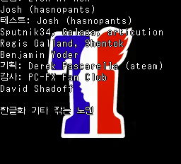 |

| 엔딩 종료 후 목록 복귀 | 엔딩 다음 영상에서도 정상 표시되는 자막 |
| --- | --- |
| 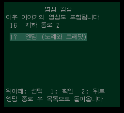 | 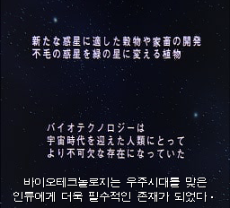 |

## 지금까지 반영한 한글화·화면·진행 수정

### 한글화와 문장 검수

- 대사 **1,371개**와 메뉴·상태·아이템·엔딩 문구를 한글화했습니다. 원래 영어로 표시되던 UI는 유지합니다.
- 전체 대사와 초기 문구 207개를 점검하고, **267개 항목의 띄어쓰기·표현·문장 길이**를 정리했습니다. 이후 제보된 ‘스스로가 자신의’ 등의 띄어쓰기와 어색한 표기도 추가로 고쳤습니다.
- 사망 메뉴의 **직전 재시도**, 아이템 사용 불가 안내, 타이머의 **분** 단위 등 누락 문구를 보완했습니다.
- 클리어 후 나레이션 **3종·23개 문구**를 한글화하고, 나레이션 마지막에 불필요한 대사창이 나타나던 흐름을 정리했습니다.
- 영상 **8개 장면의 자막 175개**를 별도 레이어로 표시합니다. v1.2에는 박사 재판 장면과 유전자실의 누락된 짧은 대사·응답·후반 문장을 추가하고 표시 구간을 조정했습니다.

| 박사 재판 장면의 누락 자막 보완 | 박사 영상 후반 대사 |
| --- | --- |
| 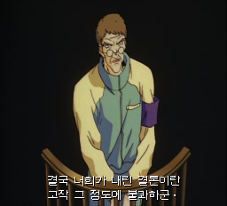 | 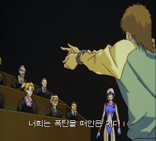 |

| 유전자실의 빠졌던 대사 보완 | 유전자실 후반 자막 |
| --- | --- |
| 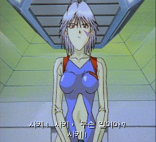 | 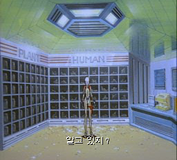 |

| 미션 1 한국어 대화 | 이어지는 한국어 대화 |
| --- | --- |
|  |  |

| 아이템 사용 불가 안내 한글화 | MO 01 자료 뒤의 후속 대사 |
| --- | --- |
| 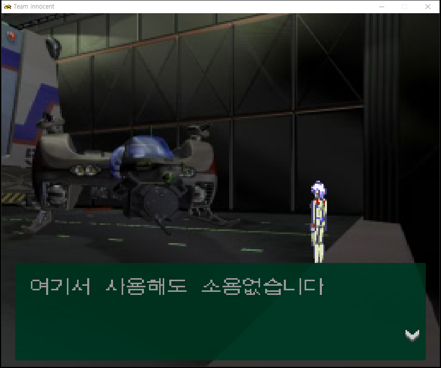 | 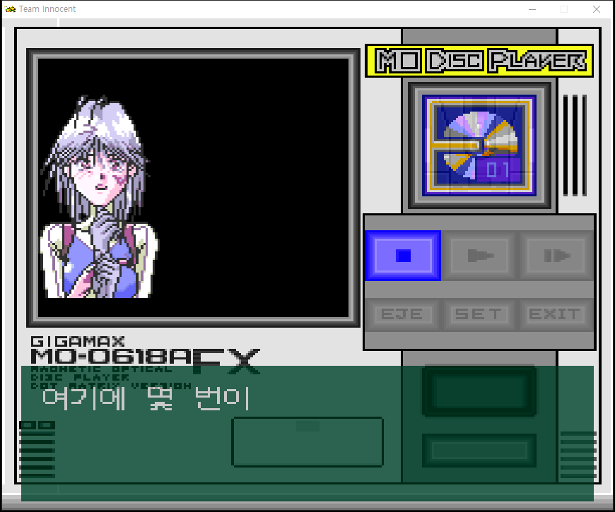 |

### 제목과 결과 화면 가운데 정렬

**SCENARIO POINT, 점수 숫자, MISSION CLEAR, PERFECT CLEAR, TRY AGAIN, SAME MISSION, CONGRATULATIONS!**를 가운데 정렬했습니다. 미션 선택·시작 화면의 한글 제목도 실제 글자 폭에 맞춰 중앙에 배치했습니다.

| 결과 문구와 점수 가운데 정렬 | CONGRATULATIONS! · PERFECT CLEAR 정렬 |
| --- | --- |
| 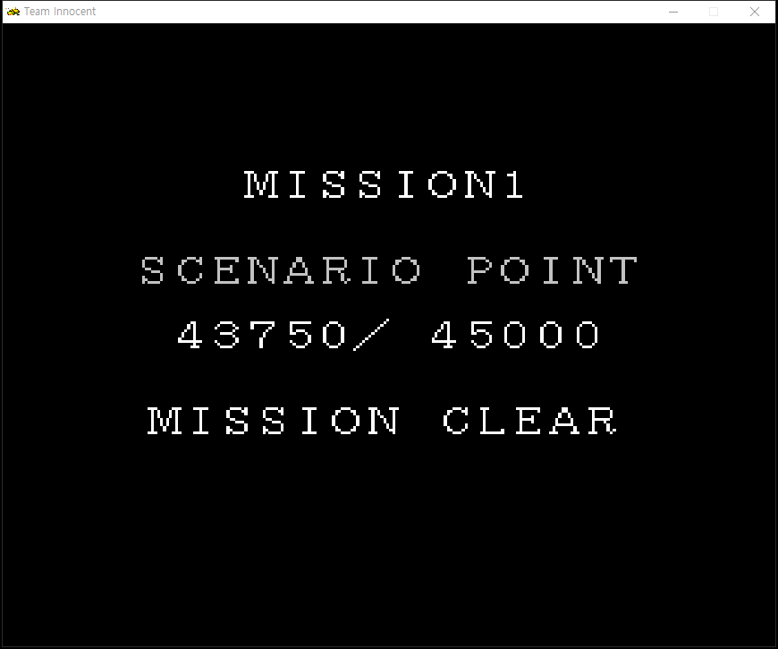 | 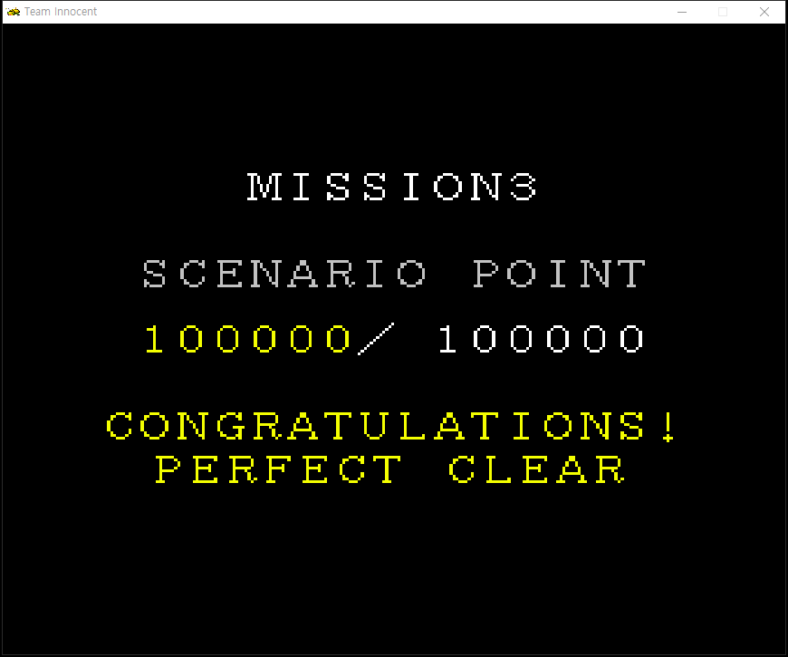 |

| 미션 2 한글 제목 정렬 | 미션 3 한글 제목 정렬 |
| --- | --- |
| 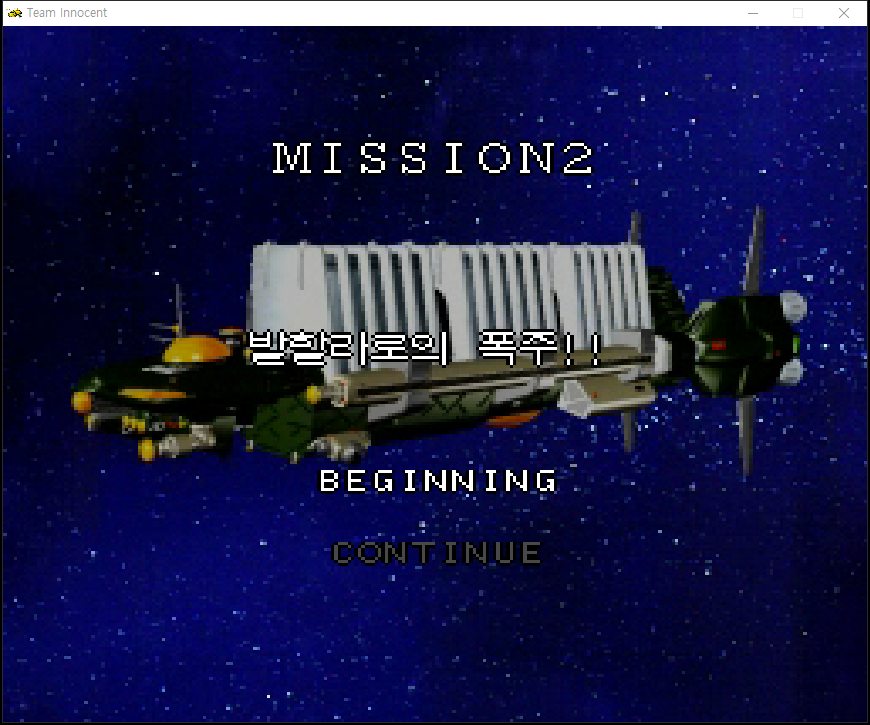 | 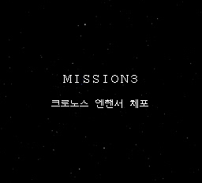 |

### 그래픽과 이벤트 진행

| 제보된 문제 | 반영한 수정 |
| --- | --- |
| 브리핑 하단 배경이 잘못 표시됨 | 배경 표시 범위와 위치 수정 |
| 영상 자막이 잠깐 화면 위로 튐 | 자막 레이어 위치와 표시 시점 수정 |
| 저장·종료 후 타이틀 화면 깨짐 | 타이틀 그래픽·색상 복귀와 RUN 안내 깜빡임 수정 |
| 미션 2 박사 영상 후 캐릭터가 사라지고 진행 불가 | 영상 종료 후 필드 복귀 처리 수정. 자연 종료·스킵, 지도 ON·OFF 조건 확인 |
| 문·방 이동 페이드에서 줄무늬와 잘못된 배경 | 화면 전환 시 표시 상태 처리 수정 |
| 기관실 컴퓨터 글자가 색 블록처럼 깨짐 | 단말기 화면 표시 수정 |
| RUN 지도를 켜면 오브젝트가 떨림 | 지도 표시와 필드 화면 처리 충돌 수정 |
| 엔딩 자막이 바뀔 때 화면이 떨림 | 자막 생성 부담을 줄여 해당 프레임의 크레딧 흔들림 수정 |
| 엔딩을 본 다음 영상의 자막 영역 깨짐 | 엔딩 종료 후 영상 자막 표시 상태 복원 |

| 복원한 브리핑 배경 | 정상 표시되는 기관실 단말기 |
| --- | --- |
|  | 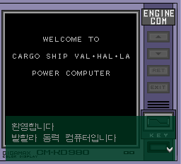 |

| 게임 진행 후 타이틀 복귀 | 한글 파일 선택 화면 |
| --- | --- |
| 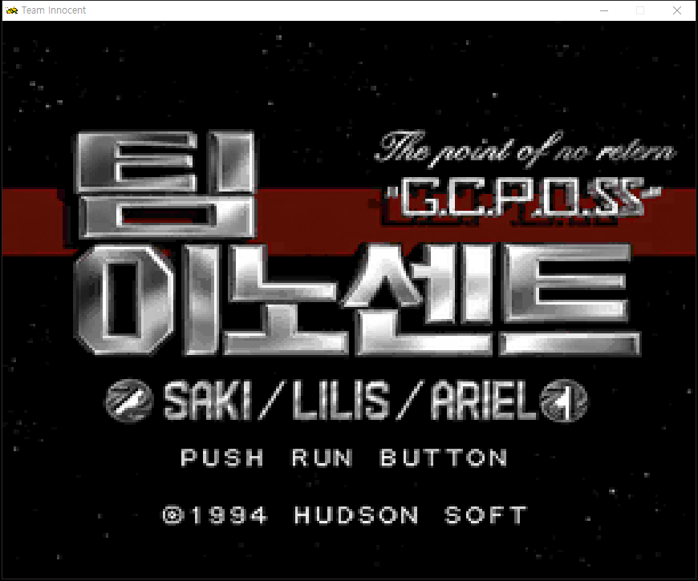 |  |

| 수정 전 — 자막 전환 순간 크레딧 표시 이상 | 수정 후 — 같은 프레임에서 정상 표시 |
| --- | --- |
| 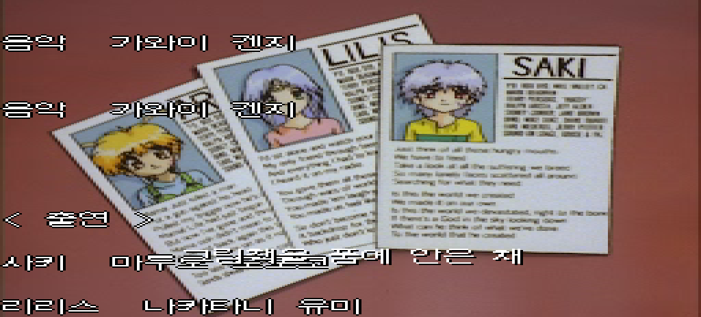 | 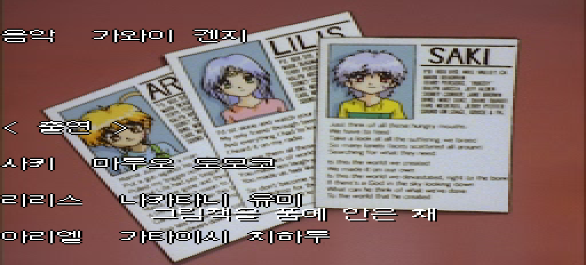 |

위 엔딩 비교는 같은 체크포인트에서 재생한 대응 프레임입니다. 이전 기능 소개에는 해당 버전에서 촬영한 실제 재현 화면을 함께 실었습니다. [전체 스크린샷과 촬영 구분](SCREENSHOTS.md)에서 더 볼 수 있습니다.

## 검수와 확인 범위

**미션 2까지 검수 완료**는 사용자 플레이 테스트와 제보 사항 반영을 기준으로 합니다. v1.2에서는 미션 3의 제보된 영상, 영상 감상 메뉴, 엔딩 재생과 자막을 PC Mednafen에서 추가 확인했습니다.

- 최신 디스크의 대사·UI·자막·실행 코드 재읽기 검사 **20개 통과**.
- 영상 감상·엔딩 관련 단위 검사 **9개 통과**, 클리어 데이터 유무에 따른 잠금, 재생·복귀와 저장 데이터 유지 확인.
- 엔딩 노래 출력, 마지막 한글화 크레딧, 자연 종료 후 목록 복귀 및 다음 영상 자막 확인.
- 엔딩 자막 46개의 픽셀 일치, 같은 조건의 **404프레임 전후 비교**로 자막 변경 시 화면 떨림 수정 확인.
- 배포 `.tipatch`와 `.xdelta`를 일본판 원본에 적용한 결과가 최신 빌드와 일치하는지 확인.

**전체 분기·모든 이동 경로·휴대폰 직접 실행·PC-FX 실기까지 검증을 마친 것은 아닙니다.** 음성 번역과 노래 가사는 원음에 대한 추가 수동 검수가 남아 있습니다. 정식 버전 이후에도 제보된 누락과 오류를 계속 보완합니다.

## 버전별 변경 이력

| 버전 | 주요 결과 |
| --- | --- |
| **v1.2 정식** | 박사·유전자실 자막 보완, 클리어 해금 영상 감상, 엔딩 다시 보기·가사·한글화 크레딧, 엔딩 화면 떨림 수정 |
| v0.95 | 미션 2까지 검수, RUN 반투명 지도, 방 이동·브리지 이벤트·단말기·지도 떨림 수정 |
| v0.85 | 조작1 신규 8방향 이동과 전용 공격, 조작2 원작 방식 선택 |
| v0.8 | 스테이지 1 검수, 대사 띄어쓰기, 클리어 나레이션, 제목·결과·점수 정렬 |
| v0.76 | 아이템 사용 안내 한글화, MO 01 진행 수정 |
| v0.755 | MO 연타 멈춤, 사망 메뉴, 타이틀 복귀 수정 |
| v0.75 | 일반 대화의 음성·모션 중단과 영상 1.2초 길게 누르기 건너뛰기 |
| v0.735·v0.73 | 대사 빠른 표시·넘기기와 자막 위치 보완 |
| v0.72·v0.7 | 초기 한글화, 브리핑 배경 복원, Windows 패처 개선 |

자세한 내용과 이전 릴리스 문서는 [누적 변경 이력](CHANGELOG.md)에 정리했습니다.

## 문제 제보

[Issues](https://github.com/OldManCraveGuitars-bit/PC-FX-Team-Innocent-Kr/issues)에 버전, 게임 구간, 증상과 스크린샷을 남겨 주세요. 영상 자막 문제는 영상 이름과 대략적인 시각, 조작 문제는 조작1·조작2 여부를 함께 적어 주시면 도움이 됩니다.

## 감사와 출처

**미국 패치 제작자분께 다시 한 번 감사드립니다.** [Team Innocent 영어 패치 팀](https://github.com/DerekPascarella/TeamInnocent-EnglishPatchPCFX)이 공개한 자료와 작업은 이번 한국어 패치 제작에 큰 도움이 됐습니다. 공개된 텍스트 변경 지점과 자료 덕분에 일본판 문구를 찾고 대조할 수 있었습니다.

**Derek Pascarella (ateam), Elmer, EsperKnight, Filler, Eien ni Hen, Josh (hasnopants)를 비롯한 영어 패치 참여자 모두에게 진심으로 감사드립니다.** 엔딩의 영어 번역팀 크레딧도 유지했습니다. 이 한국어 패치는 영어 패치 팀의 공식 배포물이 아닙니다.

한글화: **기타 깎는 노인**

게임과 원본 그래픽의 권리는 각 권리자에게 있습니다. 배포물에는 원본 게임 CUE/BIN, BIOS, 저장 파일을 포함하지 않습니다. 글꼴은 Unifont 17.0.05와 Neo둥근모 1.601을 참고했으며, 고지문은 [licenses](licenses)에 있습니다.
