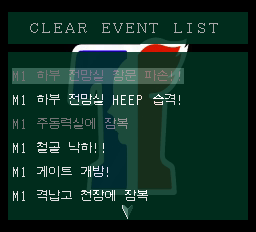
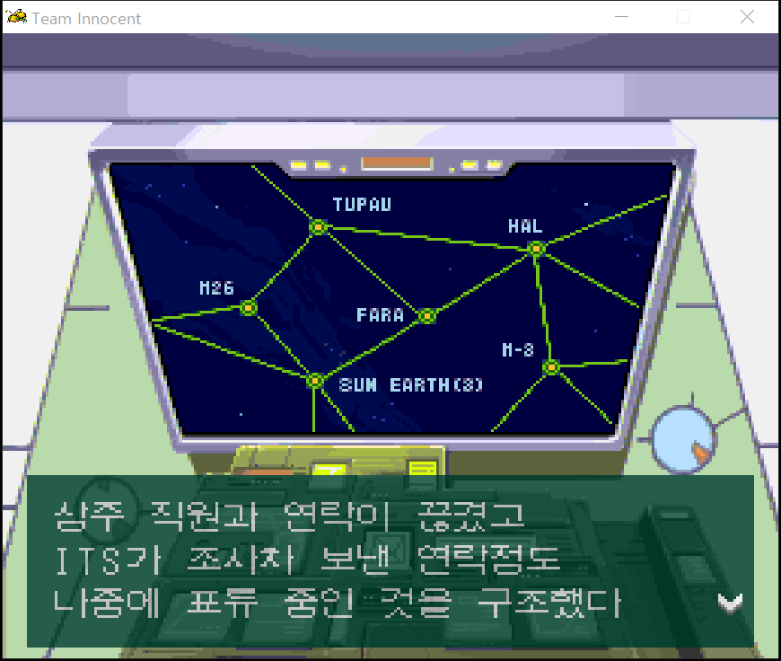
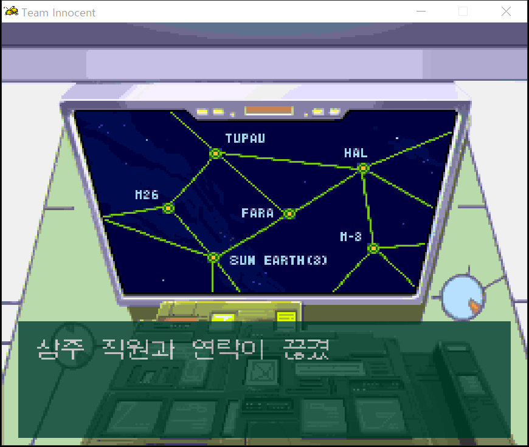

# 스크린샷 모음

[메인 페이지](README.md) · [v1.2 변경 사항](RELEASE_NOTES_v1.2.md) · [누적 변경 이력](CHANGELOG.md)

에뮬레이터에서 캡처한 **실제 화면 46장과 시작 화면 원화 1장**을 모았습니다. v1.2 추가·수정 화면과 이전 버전에서 해당 기능을 확인한 화면을 구분했습니다. 수정 전 비교 화면도 표시했습니다. 메뉴 해금, 특정 동작과 영상 장면 일부는 분리한 재현 상태에서 확인했으며, 정지 화면은 전체 연속 플레이 검증을 뜻하지 않습니다.

원본 캡처의 해상도·가로세로 비율은 유지했습니다. 작은 글씨는 이미지를 클릭하면 원본을 볼 수 있습니다. 엔딩과 미션 3 화면이 포함되어 있습니다.

## v1.2 추가·수정 화면

| 새 메인 메뉴 — 게임 시작 / 불러오기, 영상 감상, 타이틀로 | 클리어 데이터가 없으면 영상 감상이 회색으로 잠김 |
| --- | --- |
|  |  |

| 영상 감상의 17번 엔딩 선택 | 14번을 오프닝 영상 (추가 수록본)으로 안내 |
| --- | --- |
|  |  |

| 엔딩 크레딧 앞에 표시되는 한국어 노래 자막 | 영어 번역팀 다음에 추가한 한글화 기타 깎는 노인 |
| --- | --- |
|  |  |

| 엔딩 자연 종료 후 17번 선택을 유지한 목록 복귀 | 엔딩을 본 다음 다른 영상을 재생해도 자막 정상 표시 |
| --- | --- |
|  |  |

| 본편 엔딩 후의 클리어 이벤트 목록 | 박사 재판 장면의 누락 자막 보완 |
| --- | --- |
|  |  |

| 박사 영상 후반부의 한국어 자막 | 유전자실 영상에서 빠졌던 호명 대사 보완 |
| --- | --- |
|  |  |

### 유전자실 영상 후반 대사 표시

## 엔딩 자막 전환 — 수정 전후 대응 프레임

| 수정 전 — 자막 변경 프레임의 크레딧 표시 이상 | 수정 후 — 같은 프레임의 정상 크레딧 |
| --- | --- |
|  |  |

## 이전 버전에서 확인한 누적 개선 화면

| 브리핑 배경 복원 | 신규 조작의 필드 이동 확인 |
| --- | --- |
|  |  |

| 신규 조작의 사격 확인 | 조작1 선택 |
| --- | --- |
|  |  |

| 조작2 선택 | 대사 글자 완성 |
| --- | --- |
|  |  |

| 빠른 표시로 완성된 대사 | 글자를 표시하는 중 |
| --- | --- |
|  |  |

| 미션 1 한국어 대화 1 | 미션 1 한국어 대화 2 |
| --- | --- |
|  |  |

| 미션 1 지도 안내 대사 | 미션 1 지령 대사 |
| --- | --- |
|  |  |

| 다음 대사 전환 | 한글 파일 선택 화면 |
| --- | --- |
|  |  |

| 격납고 대사 완성 | 격납고의 다음 화자 대사 |
| --- | --- |
|  |  |

| 아이템 사용 불가 안내 | 미션 1 결과 문구·점수 가운데 정렬 |
| --- | --- |
|  |  |

| 미션 2 제목 가운데 정렬 | 미션 3 제목 가운데 정렬 |
| --- | --- |
|  |  |

| 연타 뒤 MO 재생 종료 | MO 녹화 한글 대사 |
| --- | --- |
|  |  |

| MO 01 자료 뒤 후속 대사 | 여성 캐릭터 영상의 한글 자막 |
| --- | --- |
|  |  |

| 별도 레이어 영상 자막 | 퍼펙트 클리어 결과 가운데 정렬 |
| --- | --- |
|  |  |

| RUN 지도 OFF | RUN 지도 ON |
| --- | --- |
|  |  |

| 기관실 단말기 표시 복원 | 게임에서 표시한 한글 시작 화면 |
| --- | --- |
|  |  |

### 진행 후 타이틀 복귀

## 시작 화면 원화

아래 이미지는 게임 실행 캡처가 아닌 시작 화면 원화입니다.

